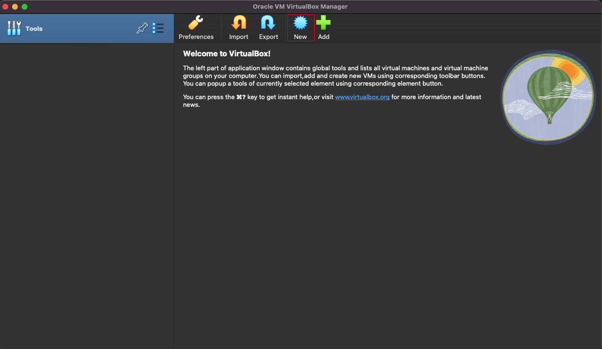
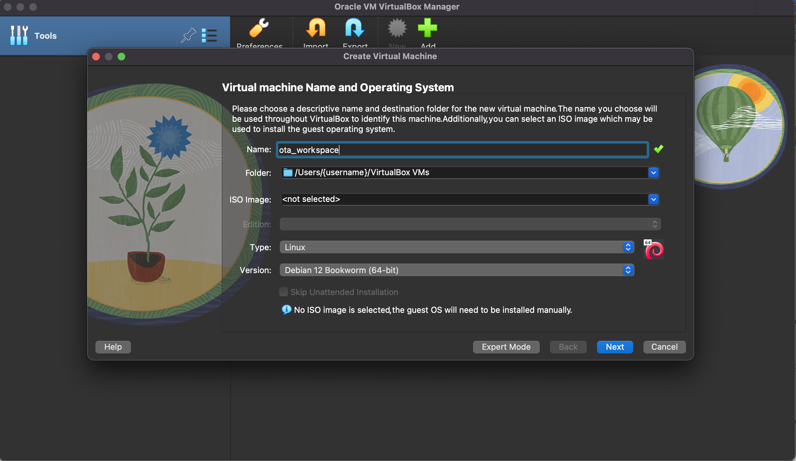
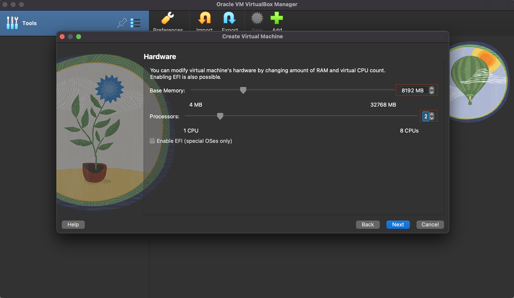
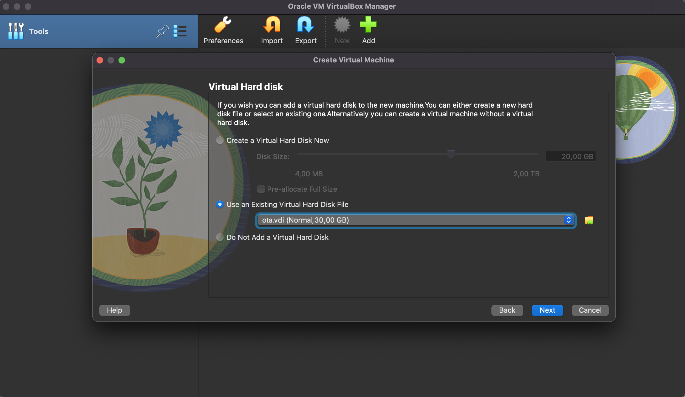
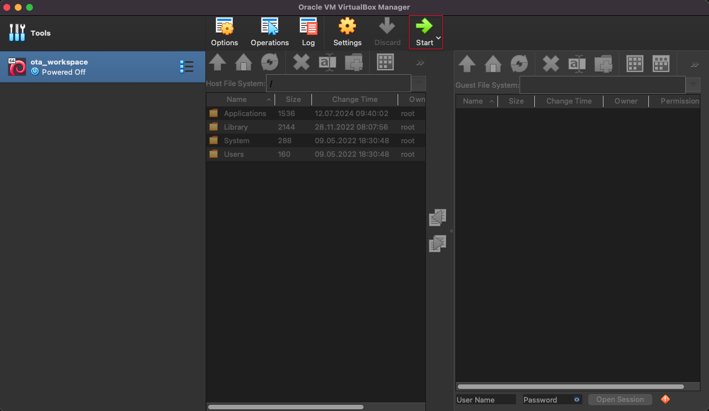
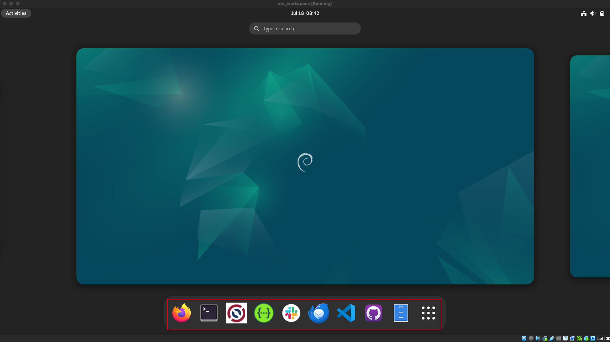

# Installing OpenTravel workspace on a local Virtual Machine using Oracle VM VirtualBox

## Purpose

To be able to run OpenTravel tools (DEx, SwaggerUI, GitHub, etc.) in a local environment avoiding charges for running a cloud based sandbox (e.g. AWS workspace).

## Current installed tools

* DEx
* SwaggerUI
* Slack
* Thunderbird
* Visual Studio Code
* GitHub Desktop

## Pre-requisites

1. Download and install Oracle VM VirtualBox (https://www.virtualbox.org/wiki/Downloads)

> "VirtualBox is a hosted hypervisor for x86 virtualization developed by Oracle Corporation. VirtualBox may be installed on Microsoft Windows, macOS, Linux, Solaris and OpenSolaris. Released under the terms of the GNU General Public License and, optionally, the CDDL for most files of the source distribution, VirtualBox is free and open-source software"

2. Download Virtual Hard Disk File (TODO: add link here)

## Steps to setup the VM (Virtual Machine)

### 1. Open VirtualBox and create a new VM

### 2. Complete the fields
* Name: select a name for the VM
* Folder: select a local path where to store the VM
* ISO image: leave it blank
* Type: Linux
* Version: Optionally and just for branding purposes, select Debian 12

### 3. Setup the hardware that you want to assign to your VM.

Suggested configuration:
* RAM: 8192MB (8GB)
* CPU: 2 
    
You can assign more or less depending on your machine available resources. This can be also modified after the VM creation inside the VM settings
    

### 4. Select the Virtual Hard Disk

* Select option "Use an Existing Virtual Hard Disk File"
* Find and select the previously downloaded file (see Pre-requisites)

### 5. Start the VM and Login

* Username: ota
* Password: ota

### 6. Access to OTA tools by pressing the Activities button on the top left of the screen

